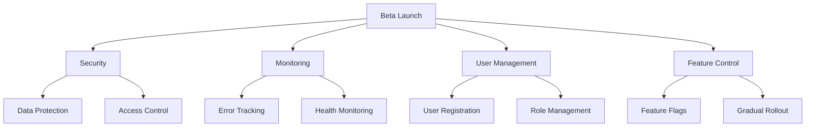

# Beta Testing Guide

## Overview
This document provides a comprehensive guide to the beta testing phase for the Medication Tracker application, ensuring alignment with our core documentation strategy.

## Critical Path


## Beta Release Checklist

### 1. Security Requirements
- [ ] SSL/TLS Configuration
  - [ ] SSL certificates installed
  - [ ] HTTPS enforced
  - [ ] Security headers configured

- [ ] Data Protection
  - [ ] Database encryption
  - [ ] Secure backup system
  - [ ] Data recovery procedures

- [ ] Access Control
  - [ ] Secure authentication
  - [ ] Rate limiting
  - [ ] Input validation

### 2. Monitoring Strategy
- [ ] Error Tracking
  - [ ] Comprehensive logging
  - [ ] Real-time alert system
  - [ ] Error reporting mechanism

- [ ] Health Monitoring
  - [ ] API health checks
  - [ ] Database connection monitoring
  - [ ] Service availability tracking

- [ ] Usage Analytics
  - [ ] User session tracking
  - [ ] Feature usage metrics
  - [ ] Performance monitoring

### 3. User Management
- [ ] Registration Process
  - [ ] Secure signup workflow
  - [ ] Role-based access control
  - [ ] User profile management

- [ ] Feature Control
  - [ ] Dynamic feature flagging
  - [ ] Granular access management
  - [ ] A/B testing support

## Technical Implementation

### Feature Flags
```python
# Enable a feature for specific users
feature_flags.enable_feature(
    'family_sharing', 
    user_ids=['user1', 'user2'], 
    rollout_percentage=10
)
```

### User Onboarding
```python
# Register a beta user
user = onboarding.onboard_user(
    email='tester@example.com',
    name='Beta Participant',
    features=['medication_tracking', 'emergency_contacts']
)
```

### Metrics Collection
```python
# Track feature interactions
metrics.track_feature_usage('family_sharing', user.id)
metrics.submit_feedback(
    user.id, 
    feature='medication_tracking', 
    message='Suggestion for improvement'
)
```

## Transition to Production

### Validation Criteria
- [ ] 100% feature validation
- [ ] Minimal error rate
- [ ] Comprehensive user feedback
- [ ] Performance benchmarks
- [ ] Security audit completion

## Best Practices
- Start with limited user groups
- Continuously monitor error logs
- Prioritize user feedback
- Incrementally expand feature access

## Cross-References
- [Security Documentation](/docs/SECURITY.md)
- [Deployment Plan](/docs/DEPLOYMENT_PLAN.md)
- [Validation Checkpoints](/docs/VALIDATION_CHECKPOINTS.md)

## Contributing
Refer to `CONTRIBUTING.md` for collaboration guidelines and submission processes.

## License
Project licensed under MIT License - see `LICENSE.md`

## Version
Last Updated: 2024-12-26
Beta Version: 0.1.0
