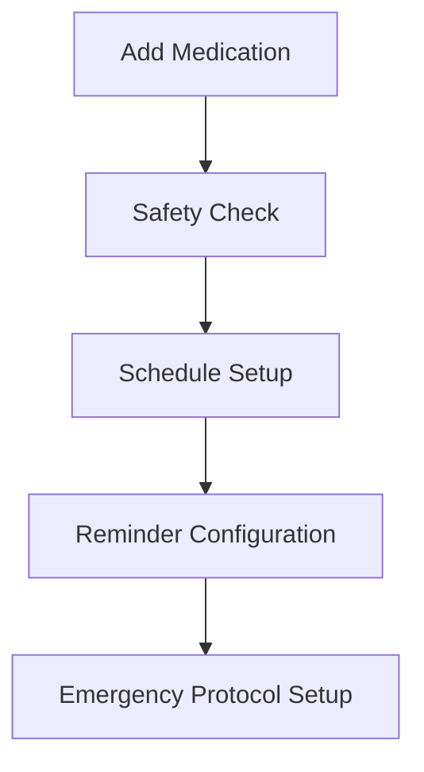
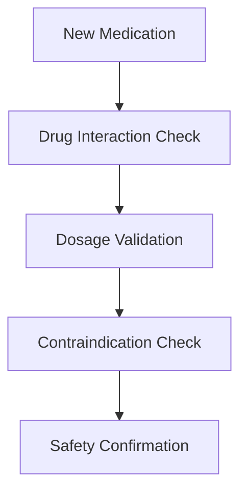
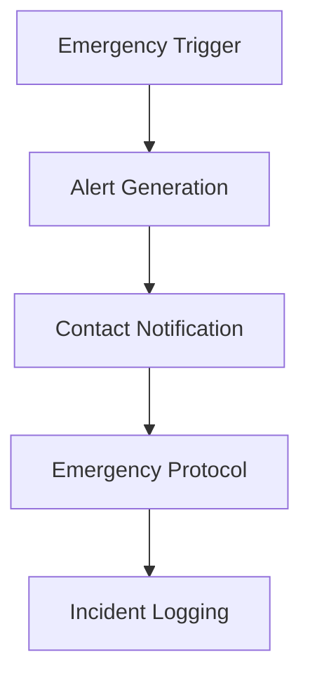

# Medication Tracker - Functional Overview

## Core Purpose
The Medication Tracker application is designed to ensure safe and reliable medication management for patients while maintaining strict HIPAA compliance and data security.

## Primary Functions

### 1. Medication Management
#### Core Features (CRITICAL)
- Medication scheduling and tracking
- Drug interaction validation
- Dosage safety checks
- Emergency protocols
- Real-time alerts

#### Supporting Features (NON-CRITICAL)
- Medication history
- Adherence tracking
- Prescription reminders
- Inventory management

### 2. Safety Validation
#### Core Features (CRITICAL)
- Drug-drug interaction checking
- Dosage validation
- Contraindication detection
- Emergency protocols
- Real-time safety alerts

#### Supporting Features (NON-CRITICAL)
- Alternative medication suggestions
- Side effect tracking
- Long-term interaction analysis
- Wellness tracking

### 3. User Management
#### Core Features (CRITICAL)
- Secure authentication
- Role-based access control
- Emergency contact management
- HIPAA-compliant data handling
- Audit logging

#### Supporting Features (NON-CRITICAL)
- Profile customization
- Preference settings
- Multiple timezone support
- Language preferences

### 4. Data Security
#### Core Features (CRITICAL)
- PHI encryption
- Access control
- Audit trails
- HIPAA compliance
- Security monitoring

#### Supporting Features (NON-CRITICAL)
- Advanced analytics
- Reporting tools
- Data export
- Backup management

## User Workflows

### 1. Medication Management (CRITICAL)

### 2. Safety Validation (CRITICAL)

### 3. Emergency Handling (CRITICAL)

## Data Flow

### 1. Medication Data (CRITICAL)
- User Input → Validation → Storage
- Schedule → Reminder → Notification
- Interaction Check → Safety Alert → Response

### 2. Security Data (CRITICAL)
- Authentication → Authorization → Access
- Action → Audit → Log
- Alert → Notification → Response

### 3. Monitoring Data (CRITICAL)
- Performance Metrics → Analysis → Alert
- Error Detection → Logging → Response
- Security Event → Audit → Action

## Integration Points

### 1. External Services (CRITICAL)
- FDA Drug Database
- Drug Interaction API
- Emergency Services
- Authentication Provider

### 2. Internal Services (CRITICAL)
- Medication Service
- Validation Service
- Notification Service
- Monitoring Service

## Success Criteria

### 1. Safety (CRITICAL)
- 100% drug interaction validation
- Real-time safety alerts
- Emergency protocol execution
- Audit trail completeness

### 2. Reliability (CRITICAL)
- 99.9% uptime
- <100ms response time
- Zero data loss
- Complete audit logs

### 3. Compliance (CRITICAL)
- HIPAA compliance
- Data encryption
- Access control
- Security monitoring

## Non-Critical Features
These features, while valuable, are not essential for the core medication safety functionality:

1. Analytics Dashboard
   - Usage patterns
   - Adherence statistics
   - Performance metrics

2. Mobile Application
   - Offline mode
   - Push notifications
   - Location services

3. Advanced Reporting
   - Custom reports
   - Data export
   - Trend analysis

4. Social Features
   - Family sharing
   - Care team collaboration
   - Community support

## Technical Requirements

### 1. Performance (CRITICAL)
- Response time < 100ms
- 99.9% uptime
- Real-time updates
- Scalable architecture

### 2. Security (CRITICAL)
- End-to-end encryption
- Role-based access
- Audit logging
- Intrusion detection

### 3. Compliance (CRITICAL)
- HIPAA standards
- Data protection
- Privacy controls
- Security monitoring

## Maintenance Requirements

### 1. Critical
- Security updates
- Bug fixes
- Performance monitoring
- Compliance audits

### 2. Non-Critical
- Feature enhancements
- UI improvements
- Analytics updates
- Report generation
