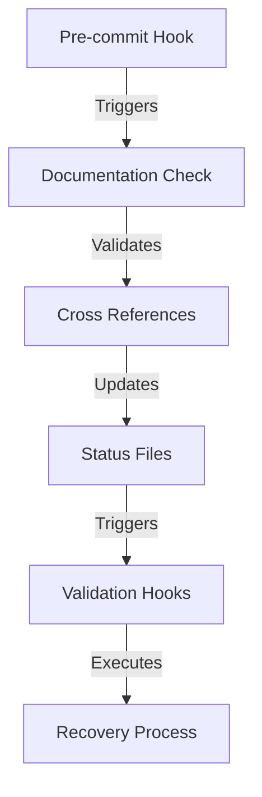

# Current Validation Status
Last Updated: 2024-12-26T14:55:31+01:00

## Overview
This document serves as the single source of truth for the current validation status of all components.

## Cross References
- [Validation Recovery](../../backend/app/core/validation_recovery.py)
- [Validation Hooks](../../backend/app/core/validation_hooks.py)
- [Production Backlog](../PRODUCTION_BACKLOG.md)
- [Pre-commit Hook](../../scripts/hooks/pre-commit.py)

## Critical Path Integration


## Components

### Preflight
- Status: Unknown
- Last Check: Not yet validated
- Details: {}
- References: 
  - [validation_recovery.py](../../backend/app/core/validation_recovery.py)
  - [validation_hooks.py](../../backend/app/core/validation_hooks.py)

### Runtime
- Status: Unknown
- Last Check: Not yet validated
- Details: {}
- References:
  - [validation_recovery.py](../../backend/app/core/validation_recovery.py)
  - [validation_hooks.py](../../backend/app/core/validation_hooks.py)

### Beta
- Status: Unknown
- Last Check: Not yet validated
- Details: {}
- References:
  - [validation_recovery.py](../../backend/app/core/validation_recovery.py)
  - [validation_hooks.py](../../backend/app/core/validation_hooks.py)

## Recovery History
See [HISTORY.md](./HISTORY.md) for detailed recovery attempts and their outcomes.

## Documentation
- All validation events are recorded in `docs/validation/records/`
- Each recovery attempt is logged with its own ID
- Status is automatically updated in README.md
- Changes are tracked in git history

## Documentation Flow
1. Pre-commit hook validates documentation consistency
2. Validation hooks update status after changes
3. Recovery process maintains documentation state
4. Cross-references are enforced by git hooks

## Validation Chain
1. Documentation check (pre-commit)
2. Cross-reference validation
3. Status update
4. Hook execution
5. Recovery (if needed)

## Recovery Process
See [validation_recovery.py](../../backend/app/core/validation_recovery.py) for implementation details.

## Production Considerations
See [PRODUCTION_BACKLOG.md](../PRODUCTION_BACKLOG.md) for future improvements.

## Critical Paths
```
Validation.Flow
├── PreFlight.Validation
│   └── Recovery.Validation
├── Runtime.Validation
│   └── Recovery.Validation
└── Beta.Validation
    └── Recovery.Validation
