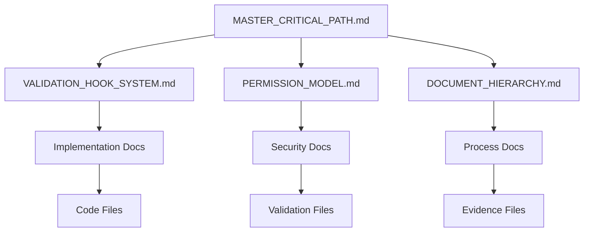

# Document Hierarchy
Last Updated: 2024-12-25T11:51:50+01:00
Status: ACTIVE
Version: 1.1.0
Permission: CORE
Scope: DOCUMENTATION
Reference: MASTER_CRITICAL_PATH.md

## Document Structure

## Document Levels

### 1. System Level (Permission: SYSTEM)
- MASTER_CRITICAL_PATH.md
- VALIDATION_HOOK_SYSTEM.md
- PERMISSION_MODEL.md

### 2. Core Level (Permission: CORE)
- DOCUMENT_HIERARCHY.md
- Implementation guides
- Security protocols

### 3. Implementation Level (Permission: IMPLEMENTATION)
- Feature documentation
- Test documentation
- Process guides

## Reference Rules

### 1. Upward References
- Documents reference parents
- No circular references
- Clear dependency chain

### 2. Downward References
- Implementation details only
- No critical path exposure
- Clear boundaries

### 3. Cross References
- Same-level allowed
- Must be validated
- Clear purpose

## Validation Requirements

### 1. System Documents
- Full validation suite
- Critical path check
- Security review

### 2. Core Documents
- Reference validation
- Hierarchy check
- Evidence collection

### 3. Implementation Documents
- Basic validation
- Reference check
- Update tracking

## Update Protocol

### 1. System Updates
- Require approval
- Full validation
- Evidence collection

### 2. Core Updates
- Permission check
- Validation suite
- Reference update

### 3. Implementation Updates
- Basic validation
- Reference check
- Documentation update

## Evidence Requirements

### 1. System Evidence
- Validation results
- Security checks
- Performance impact

### 2. Core Evidence
- Reference integrity
- Hierarchy compliance
- Update tracking

### 3. Implementation Evidence
- Basic validation
- Reference checks
- Update logs

## Monitoring Requirements

### 1. System Monitoring
- Critical path alignment
- Security compliance
- Performance metrics

### 2. Core Monitoring
- Reference integrity
- Hierarchy status
- Update tracking

### 3. Implementation Monitoring
- Basic validation
- Reference status
- Update tracking
