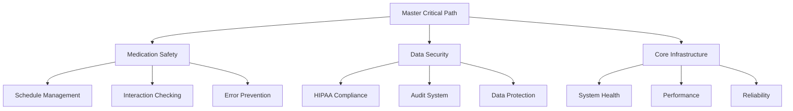

# Master Critical Path Document
Last Updated: 2024-12-25T11:51:50+01:00
Status: ACTIVE
Version: 1.1.0
Permission: SYSTEM
Scope: CRITICAL_PATH

## Overview
This document serves as the SINGLE SOURCE OF TRUTH for the entire Medication Tracker application's critical path. All other documentation and implementation must align with this master document.

## Core Mission
To provide a secure, reliable medication tracking system that ensures patient safety through accurate scheduling, interaction checking, and proper security measures.

## Critical Path Hierarchy

## Primary Critical Paths

### 1. Medication Safety (HIGHEST)
- Schedule Management
  - Accurate timing
  - Dosage tracking
  - Conflict prevention
- Interaction Checking
  - Drug-drug interactions
  - Drug-condition interactions
  - Timing conflicts
- Error Prevention
  - Input validation
  - Double verification
  - Alert system

### 2. Data Security (HIGH)
- HIPAA Compliance
  - Data encryption
  - Access control
  - Audit logging
- Protected Health Information
  - Data classification
  - Access tracking
  - Breach prevention
- Security Monitoring
  - Access patterns
  - Threat detection
  - Response system

### 3. Core Infrastructure (HIGH)
- System Reliability
  - Uptime monitoring
  - Error handling
  - Recovery procedures
- Performance Monitoring
  - Response times
  - Resource usage
  - Optimization metrics
- Evidence Collection
  - Validation data
  - Compliance proof
  - Audit trails

## Implementation Phases

### Phase 1: Core Safety (CURRENT)
- Schedule management system
- Basic interaction checking
- Essential security measures

### Phase 2: Enhanced Security
- Advanced HIPAA compliance
- Comprehensive audit system
- Enhanced encryption

### Phase 3: Infrastructure Optimization
- Performance improvements
- Scalability enhancements
- Advanced monitoring

## Validation Requirements

### 1. Safety Validation
- Schedule accuracy tests
- Interaction verification
- Error handling validation

### 2. Security Validation
- HIPAA compliance checks
- Security penetration tests
- Audit system verification

### 3. Infrastructure Validation
- Performance benchmarks
- Reliability metrics
- Monitoring validation

## Change Management

### 1. Critical Path Changes
- Require explicit approval
- Must maintain safety
- Need security review

### 2. Implementation Changes
- Must align with critical path
- Require validation
- Need documentation

### 3. Documentation Updates
- Must reference master
- Require validation
- Need evidence

## Monitoring Requirements

### 1. Safety Monitoring
- Schedule execution
- Interaction checks
- Error rates

### 2. Security Monitoring
- Access patterns
- Security events
- Compliance status

### 3. Infrastructure Monitoring
- System health
- Performance metrics
- Resource usage

## Evidence Requirements

### 1. Safety Evidence
- Test results
- Validation reports
- Error logs

### 2. Security Evidence
- Audit logs
- Compliance reports
- Security scans

### 3. Infrastructure Evidence
- Performance data
- Reliability metrics
- Monitoring logs
