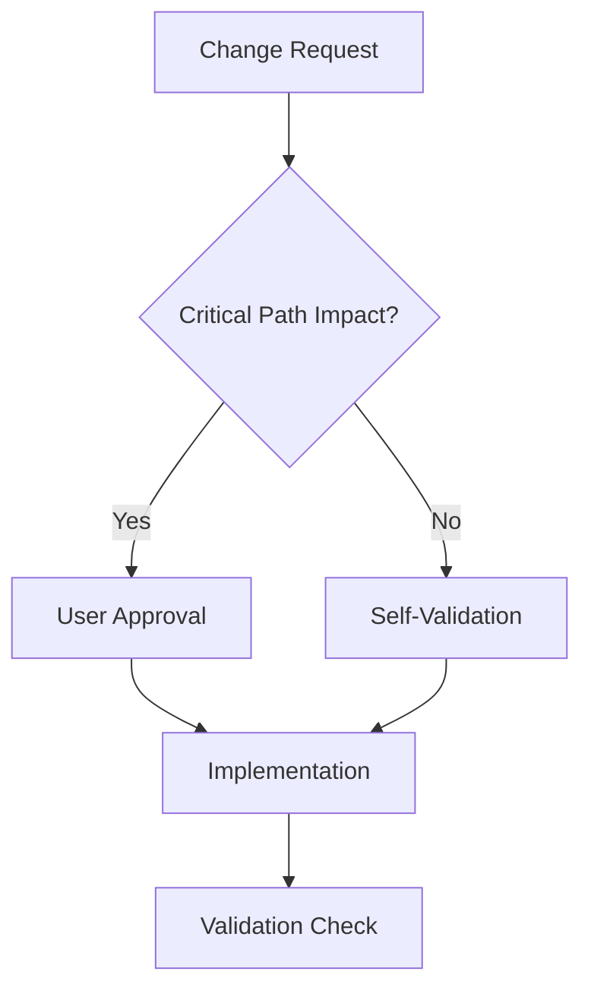
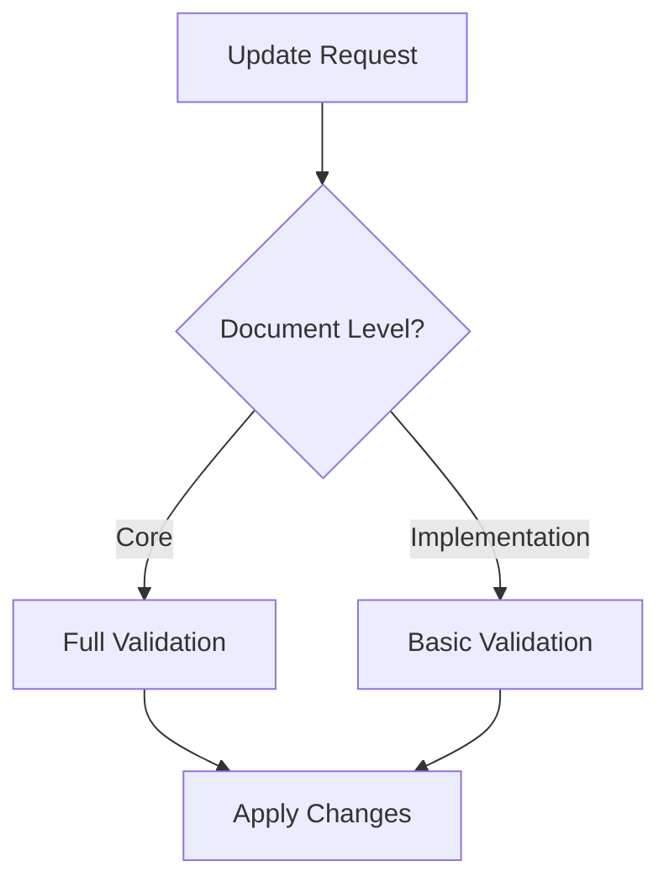
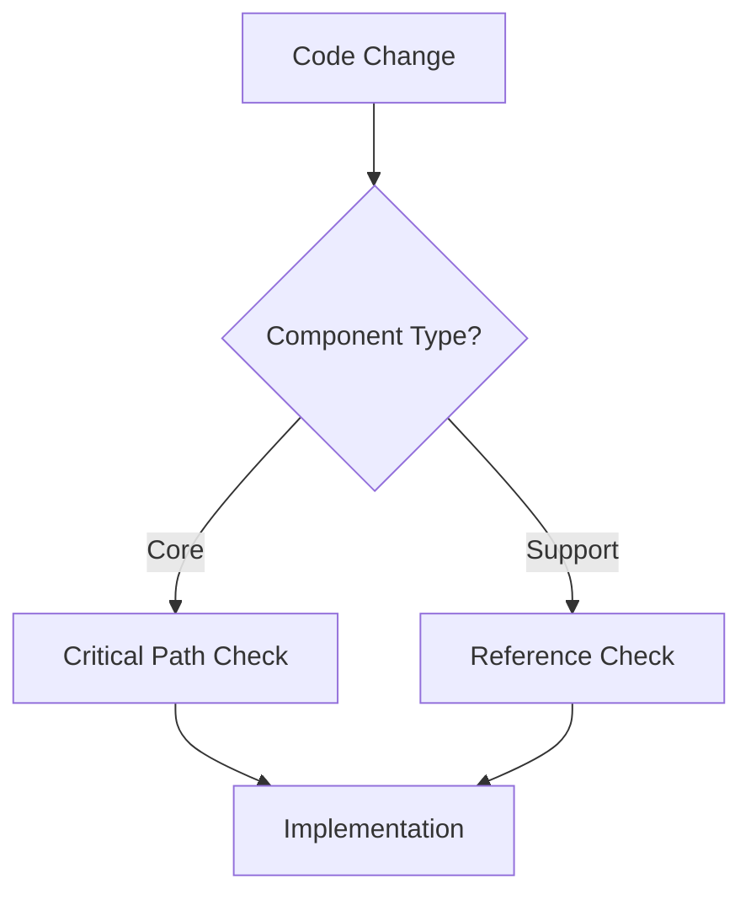

# Validation Permission Model
Last Updated: 2024-12-25T11:50:52+01:00
Status: ACTIVE
Reference: MASTER_CRITICAL_PATH.md

## Permission Levels

### 1. System Level
- **Critical Path Updates**
  - Requires: User approval
  - Scope: MASTER_CRITICAL_PATH.md and core validation
  - Validation: Full validation chain

- **Validation System Updates**
  - Requires: Self-validation check
  - Scope: Validation mechanisms
  - Validation: Critical path alignment

### 2. Document Level
- **Core Documents**
  - Access: Read/Write with validation
  - Requires: Reference check
  - Validation: Hierarchy compliance

- **Implementation Documents**
  - Access: Read/Write
  - Requires: Critical path alignment
  - Validation: Reference integrity

### 3. Code Level
- **Core Components**
  - Access: Read/Write with validation
  - Requires: Critical path check
  - Validation: Implementation compliance

- **Support Components**
  - Access: Read/Write
  - Requires: Reference integrity
  - Validation: Basic validation

## Validation Rules

### 1. Critical Path Changes

### 2. Document Updates

### 3. Code Modifications

## Self-Management Protocol

### 1. System Updates
- Can modify validation system
- Must maintain critical path alignment
- Must preserve existing validations
- Must log all changes

### 2. Document Management
- Can update documents
- Must maintain references
- Must verify hierarchy
- Must collect evidence

### 3. Code Changes
- Can modify implementation
- Must validate against critical path
- Must maintain documentation
- Must update references

## Override Protocol

### 1. Emergency Changes
- Document necessity
- Verify critical path impact
- Implement with logging
- Post-implementation validation

### 2. System Maintenance
- Schedule maintenance window
- Document changes
- Implement with validation
- Verify system integrity

## Validation Chain

### 1. Pre-Change
- Check permission level
- Verify references
- Validate hierarchy
- Check critical path

### 2. During Change
- Apply modifications
- Update references
- Maintain integrity
- Log changes

### 3. Post-Change
- Verify changes
- Update documentation
- Collect evidence
- Confirm compliance
