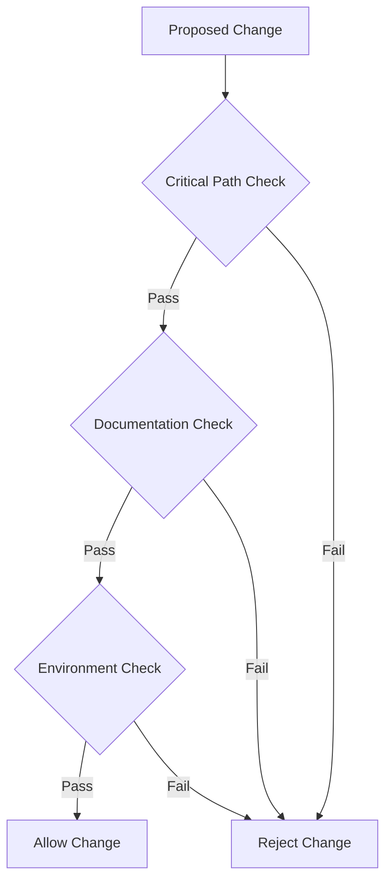

# Mandatory Validation Hook System
Last Updated: 2024-12-24T22:23:38+01:00

## MANDATORY PRE-IMPLEMENTATION REQUIREMENTS

This document defines the MANDATORY validation hooks that MUST be executed before ANY changes to the codebase. NO EXCEPTIONS.

### 1. Critical Path Validation Hook

#### Mandatory Steps
1. Check critical path alignment
2. Verify single source of truth
3. Validate environment requirements
4. Document validation evidence

#### Implementation
```
pre-commit-hook
├── critical_path_check
│   ├── validate_alignment
│   ├── check_documentation
│   └── verify_requirements
└── validation_chain
    ├── evidence_collection
    └── state_verification
```

### 2. Single Source of Truth Hook

#### Validation Points
- [ ] Documentation exists in `/docs/validation/`
- [ ] References are up to date
- [ ] Validation chain is maintained
- [ ] Evidence is collected

#### Required Documents
1. Pre-validation checklist
2. Implementation requirements
3. Evidence documentation
4. Post-validation report

### 3. Environment Validation Hook

#### Security Requirements
- [ ] HIPAA compliance check
- [ ] Security validation
- [ ] Access control verification
- [ ] Audit logging confirmation

#### Evidence Collection
- [ ] Validation timestamps
- [ ] Chain integrity
- [ ] Documentation updates
- [ ] Reference verification

## Implementation Process

### 1. Pre-Change Validation


### 2. Required Evidence
Each hook MUST generate:
1. Validation timestamp
2. Evidence document
3. Chain verification
4. State validation

### 3. Enforcement
- All hooks are MANDATORY
- No override without documented approval
- Automated enforcement in CI/CD
- Regular compliance audits

## Integration

### 1. Development Workflow
```
git pre-commit hook
└── validation_hook.py
    ├── critical_path_check()
    ├── single_source_check()
    └── environment_check()
```

### 2. CI/CD Integration
```yaml
validation_stage:
  pre_steps:
    - critical_path_validation
    - documentation_verification
    - environment_validation
  post_steps:
    - evidence_collection
    - chain_verification
```

## References
- [CRITICAL_PATH.md](CRITICAL_PATH.md)
- [SINGLE_SOURCE_VALIDATION.md](SINGLE_SOURCE_VALIDATION.md)
- [CORE_VALIDATION_PROCESS.md](CORE_VALIDATION_PROCESS.md)
