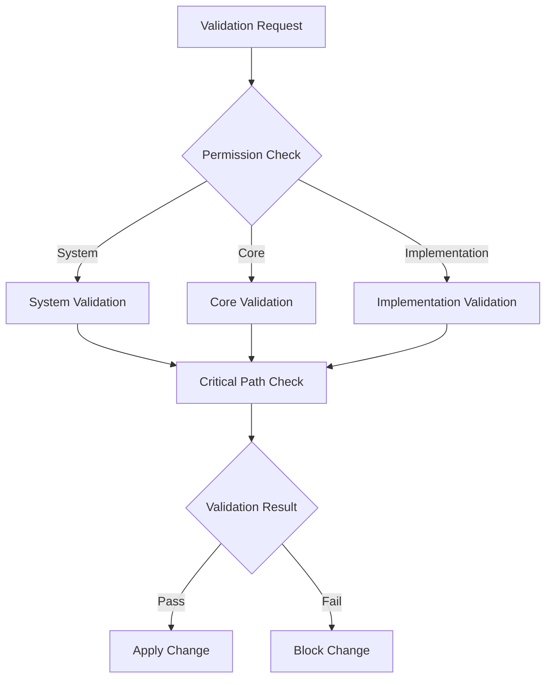

# Validation Hook System
Last Updated: 2024-12-25T11:51:50+01:00
Status: ACTIVE
Version: 1.1.0
Permission: SYSTEM
Scope: VALIDATION_SYSTEM
Reference: MASTER_CRITICAL_PATH.md

## Overview
This document defines the validation hook system that ensures all changes maintain critical path alignment and documentation integrity.

## Validation Architecture

## Permission Levels

### 1. System Level
- Critical path modifications
- Validation system updates
- Core security changes

### 2. Core Level
- Documentation updates
- Implementation validation
- Security monitoring

### 3. Implementation Level
- Feature development
- Test implementation
- Monitoring setup

## Validation Rules

### 1. Critical Path Validation
- Must maintain safety
- Must preserve security
- Must ensure reliability

### 2. Documentation Validation
- Must reference master
- Must maintain hierarchy
- Must provide evidence

### 3. Implementation Validation
- Must align with critical path
- Must follow standards
- Must include tests

## Hook Implementation

### 1. Pre-Commit Hooks
- Reference validation
- Permission checking
- Critical path alignment

### 2. Pre-Push Hooks
- Full validation suite
- Documentation check
- Test execution

### 3. Runtime Hooks
- Continuous validation
- Monitoring checks
- Security validation

## Evidence Collection

### 1. Validation Evidence
- Test results
- Compliance checks
- Performance metrics

### 2. Documentation Evidence
- Reference integrity
- Hierarchy compliance
- Update tracking

### 3. Implementation Evidence
- Code coverage
- Security scans
- Performance tests

## Override Protocol

### 1. Emergency Changes
- Document necessity
- Get approval
- Track changes
- Post-validation

### 2. System Updates
- Validate impact
- Test changes
- Update docs
- Monitor effects

### 3. Critical Fixes
- Assess urgency
- Quick validation
- Apply fix
- Full validation

## Monitoring Integration

### 1. Validation Monitoring
- Hook execution
- Validation results
- Override tracking

### 2. System Monitoring
- Performance impact
- Resource usage
- Error rates

### 3. Security Monitoring
- Access patterns
- Change tracking
- Audit logging
