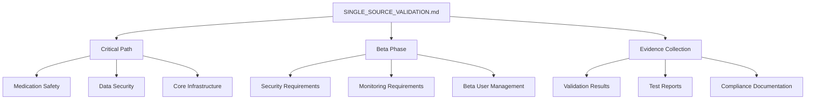

# Medication Tracker Validation Map
Last Updated: 2024-12-24
Reference: SINGLE_SOURCE_VALIDATION.md

## Core Validation Architecture



## Critical Path Integration

### 1. Medication Safety (HIGHEST)
- Validation IDs: VALIDATION-MED-*
- Evidence Path: /logs/validation/medication/
- Required Files:
  - SINGLE_SOURCE_VALIDATION.md
  - medication_safety.py
  - test_medication_safety.py

### 2. Data Security (HIGH)
- Validation IDs: VALIDATION-SEC-*
- Evidence Path: /logs/validation/security/
- Required Files:
  - security_validation.py
  - test_security_validation.py
  - SECURITY_COMPLIANCE.md

### 3. Core Infrastructure (HIGH)
- Validation IDs: VALIDATION-INFRA-*
- Evidence Path: /logs/validation/infrastructure/
- Required Files:
  - infrastructure_validation.py
  - test_infrastructure_validation.py
  - INFRASTRUCTURE_COMPLIANCE.md

## Beta Phase Integration

### 1. Security Requirements
- Validation IDs: VALIDATION-BETA-SEC-*
- Evidence Path: /logs/validation/beta/security/
- Required Files:
  - security_validation.py
  - SECURITY_REQUIREMENTS.md

### 2. Monitoring Requirements
- Validation IDs: VALIDATION-BETA-MON-*
- Evidence Path: /logs/validation/beta/monitoring/
- Required Files:
  - validation_monitoring.py
  - MONITORING_REQUIREMENTS.md

### 3. Beta User Management
- Validation IDs: VALIDATION-BETA-USER-*
- Evidence Path: /logs/validation/beta/users/
- Required Files:
  - beta_user_validation.py
  - BETA_FEATURES.md

## Validation Process Flow

1. Pre-Implementation
   ```
   Check SINGLE_SOURCE_VALIDATION.md
   ↓
   Verify Critical Path Alignment
   ↓
   Confirm Beta Phase Requirements
   ↓
   Setup Evidence Collection
   ```

2. During Implementation
   ```
   Run Validation Guards
   ↓
   Collect Evidence
   ↓
   Update Documentation
   ↓
   Maintain Audit Trail
   ```

3. Post-Implementation
   ```
   Verify Validation Results
   ↓
   Generate Test Reports
   ↓
   Update Compliance Docs
   ↓
   Sign-off Process
   ```

## Required Validation Tools

### 1. Validation Guards
- security_validation.py
- validation_monitoring.py
- beta_user_validation.py

### 2. Evidence Collectors
- medication_evidence.py
- security_evidence.py
- monitoring_evidence.py

### 3. Compliance Checkers
- hipaa_compliance.py
- data_protection.py
- audit_compliance.py

## Integration Points

### 1. Frontend Integration
- All components must use validation guards
- Must maintain evidence collection
- Must support monitoring
- Must enforce security

### 2. Backend Integration
- All routes must use validation decorators
- Must maintain audit trails
- Must collect evidence
- Must enforce compliance

### 3. Infrastructure Integration
- All services must pass validation
- Must maintain monitoring
- Must collect evidence
- Must support compliance

## Validation Maintenance

### 1. Documentation Updates
- SINGLE_SOURCE_VALIDATION.md is source of truth
- All changes must be documented
- Evidence must be maintained
- Compliance must be verified

### 2. Code Updates
- Must pass validation guards
- Must maintain evidence
- Must support monitoring
- Must enforce security

### 3. Process Updates
- Must follow validation flow
- Must maintain evidence
- Must update documentation
- Must verify compliance
