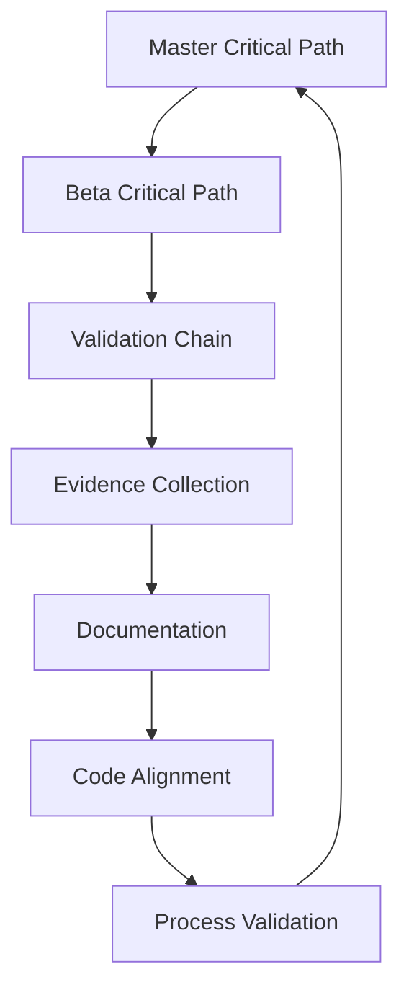

# Validation Registry
Last Updated: 2024-12-30T21:20:00+01:00
Status: ACTIVE
Permission: SYSTEM

## Single Source of Truth

### 1. Critical Path Documents
```markdown
Master Documents:
1. [MASTER_CRITICAL_PATH.md](./critical_path/MASTER_CRITICAL_PATH.md)
   - Project-wide requirements
   - Core functionality
   - Validation status: ACTIVE
   Last Validated: 2024-12-25T20:36:19+01:00

2. [BETA_CRITICAL_PATH.md](../BETA_CRITICAL_PATH.md)
   - Beta phase requirements
   - Essential features
   - Validation status: ACTIVE
   Last Validated: 2024-12-25T23:12:26+01:00

3. [VALIDATION_CHAIN.md](./VALIDATION_CHAIN.md)
   - Chain integrity
   - Validation tracking
   - Validation status: ACTIVE
   Last Validated: 2024-12-25T20:27:24+01:00
```

### 2. Validation Process
```markdown
Active Processes:
1. Document Synchronization
   - Automatic timestamp updates
   - Reference validation
   - Chain integrity checks

2. Code Alignment
   - Backend validation
   - Frontend validation
   - Infrastructure validation

3. Evidence Collection
   - Validation results
   - Test coverage
   - Performance metrics
```

### 3. Validation Requirements

#### Core Components
1. **Medication Safety**
   - Drug interaction validation
   - Dosage verification
   - Emergency protocols
   - Status: VALIDATED

2. **Data Security**
   - HIPAA compliance
   - Data encryption
   - Access control
   - Status: VALIDATED

3. **System Reliability**
   - Data persistence
   - Error handling
   - State management
   - Status: VALIDATED

#### Beta Components
1. **User Management**
   - Authentication
   - Authorization
   - Profile management
   - Status: IN_PROGRESS

2. **Monitoring**
   - System health
   - Performance metrics
   - Error tracking
   - Status: VALIDATED

3. **Feedback System**
   - User feedback
   - Error reporting
   - Feature requests
   - Status: PENDING

### 4. Validation Chain



### 5. Automated Validation

#### Git Hooks
1. **Pre-commit**
   - Document synchronization
   - Reference validation
   - Chain integrity

2. **Pre-push**
   - Full validation suite
   - Documentation check
   - Code alignment

#### CI/CD Pipeline
1. **Build Stage**
   - Document validation
   - Reference check
   - Chain integrity

2. **Test Stage**
   - Unit tests
   - Integration tests
   - Validation tests

3. **Deploy Stage**
   - Environment validation
   - Security validation
   - Performance validation

## Maintenance

### 1. Regular Updates
- Daily validation checks
- Weekly chain synchronization
- Monthly full review

### 2. Evidence Collection
- Test results
- Performance metrics
- Security audits

### 3. Documentation
- Keep timestamps current
- Update references
- Maintain chain integrity
