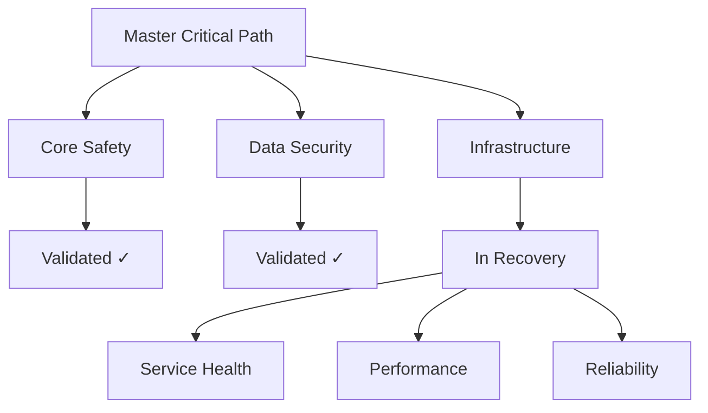

# Recovery Critical Path Alignment
Last Updated: 2024-12-25T12:36:52+01:00
Status: ACTIVE
Permission: SYSTEM
Reference: MASTER_CRITICAL_PATH.md

## Critical Path Verification

### 1. Core Mission Alignment
```markdown
Mission: Secure, reliable medication tracking system
Current Focus: Infrastructure reliability
Status: ALIGNED
```

### 2. Critical Path Hierarchy


### 3. Validation Chain Status
- Core Safety: MAINTAINED
- Data Security: MAINTAINED
- Infrastructure: RECOVERY_REQUIRED

## Recovery Path Integration

### 1. Critical Requirements
MUST maintain:
- [ ] Core safety features
- [ ] Security measures
- [ ] Data integrity
- [ ] Service reliability

### 2. Recovery Priorities
Aligned with critical path:
1. Service stability
2. Infrastructure health
3. Performance optimization
4. Reliability enhancement

### 3. Validation Requirements
Following critical path:
- [ ] Pre-validation checks
- [ ] State verification
- [ ] Evidence collection
- [ ] Chain maintenance

## Implementation Order

### 1. Service Recovery
MUST follow:
1. Validate current state
2. Verify core functions
3. Check security measures
4. Test infrastructure

### 2. Infrastructure Validation
MUST ensure:
1. Container integrity
2. Service health
3. Resource availability
4. Performance metrics

### 3. Documentation Updates
MUST maintain:
1. Validation chain
2. Critical path evidence
3. Recovery documentation
4. State verification

## Success Criteria

### 1. Critical Path Alignment
VERIFY:
- [ ] Core mission maintained
- [ ] Safety features intact
- [ ] Security measures active
- [ ] Infrastructure stable

### 2. Validation Chain
ENSURE:
- [ ] Chain continuity
- [ ] Evidence collection
- [ ] Documentation complete
- [ ] State verified

### 3. Recovery Integration
CONFIRM:
- [ ] Process alignment
- [ ] Path maintenance
- [ ] Validation complete
- [ ] Chain restored

This document ensures our recovery process maintains critical path alignment.
